# Diagramme de classes avec Mermaid
Dans ce dossier se trouve le diagramme de classes généré avec Mermaid:

Ce fichier a été généré sur le site [https://mermaid.live](mermaid.live), l'éditeur en ligne pour Mermaid.
Le code source a été sauvegardé dans `source.mermaid`.

*Note : `.mermaid` n'est pas une extension de fichier reconnue, mais utilisons-la entre nous pour nos sources Mermaid.*