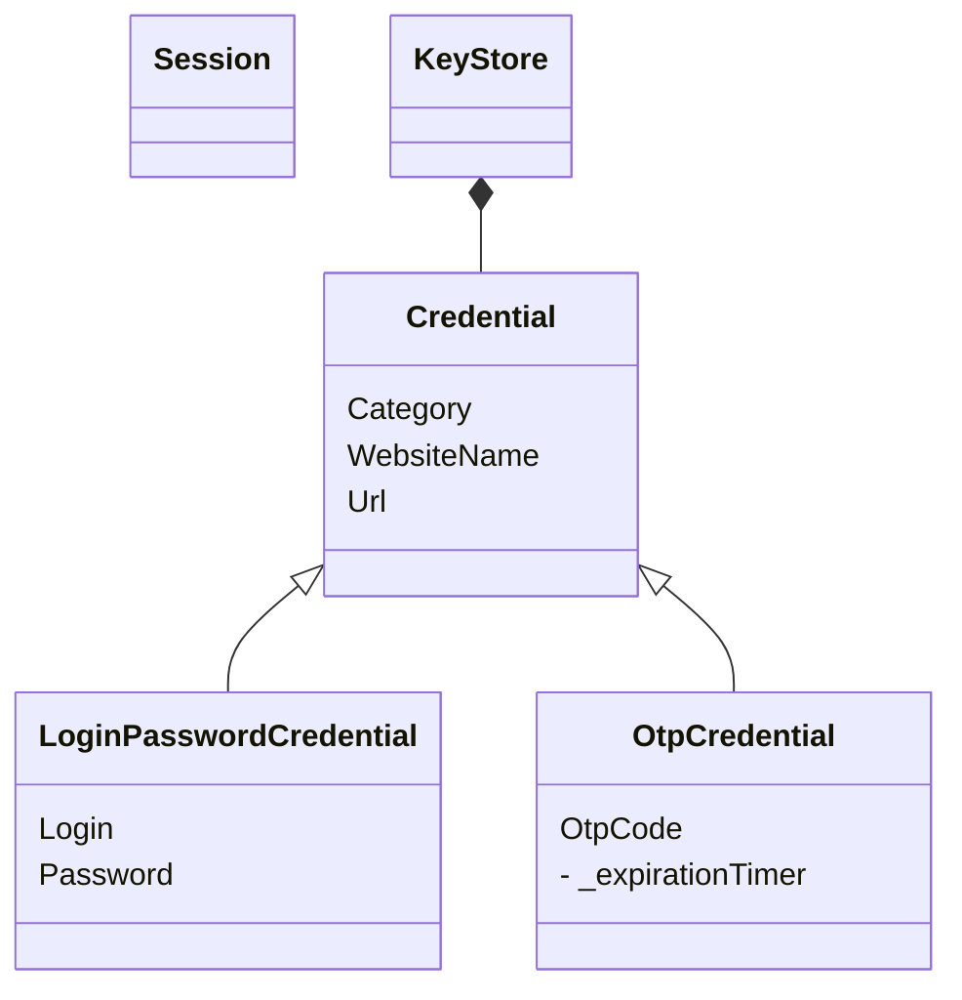

# Mermaid-generated simple class diagram
You'll find in this directory a class diagram generated with the help of gitea:

This is the source code. You can modify it in a text editor, and regenerate an svg or png thanks to [mermaid.live](https://mermaid.live)