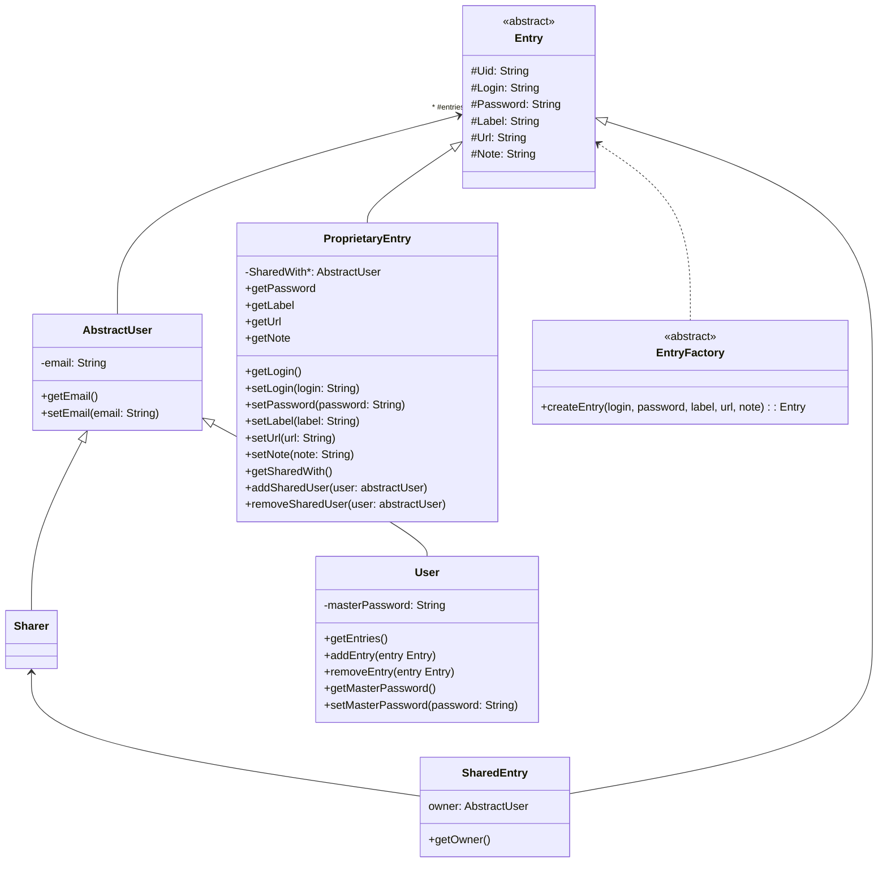
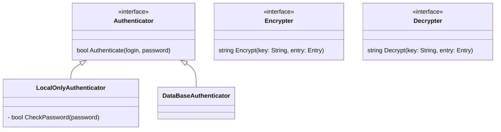

```mermaid
classDiagram

class Entry{
    <<abstract>>
    #Uid: String
    #Login: String
    #Password: String
    #Label: String
    #Url: String
    #Note: String
}
class AbstractUser{
    -email: String

    +getEmail()
    +setEmail(email: String)
}
Entry "* #entries"<-- AbstractUser
class ProprietaryEntry{
    -SharedWith*: AbstractUser

    +getLogin()
    +setLogin(login: String)
    +getPassword
    +setPassword(password: String)
    +getLabel
    +setLabel(label: String)
    +getUrl
    +setUrl(url: String)
    +getNote
    +setNote(note: String)
    +getSharedWith()
    +addSharedUser(user: abstractUser)
    +removeSharedUser(user: abstractUser)
}
Entry <|-- ProprietaryEntry

class SharedEntry{
    owner: AbstractUser
    +getOwner()
}
Sharer <-- SharedEntry
Entry <|-- SharedEntry

%%classes that use ProprietaryEntry

class User{
    -masterPassword: String

    +getEntries()
    +addEntry(entry Entry)
    +removeEntry(entry Entry)
    +getMasterPassword()
    +setMasterPassword(password: String)
}
AbstractUser <|-- User

class Sharer{
    
}
AbstractUser <|-- Sharer

class EntryFactory{
    <<abstract>>
    +createEntry(login, password, label, url, note): Entry
}
Entry <.. EntryFactory
```

```mermaid
classDiagram

Authenticator <|-- LocalOnlyAuthenticator
Authenticator <|-- DataBaseAuthenticator
class Authenticator{
    <<interface>>
    bool Authenticate(login, password)
}
class LocalOnlyAuthenticator{
    - bool CheckPassword(password)
}

class Encrypter {
    <<interface>>
    string Encrypt(key: String, entry: Entry)
}
class Decrypter{
    <<interface>>
    string Decrypt(key: String, entry: Entry)
}
```

note: add autocompletion