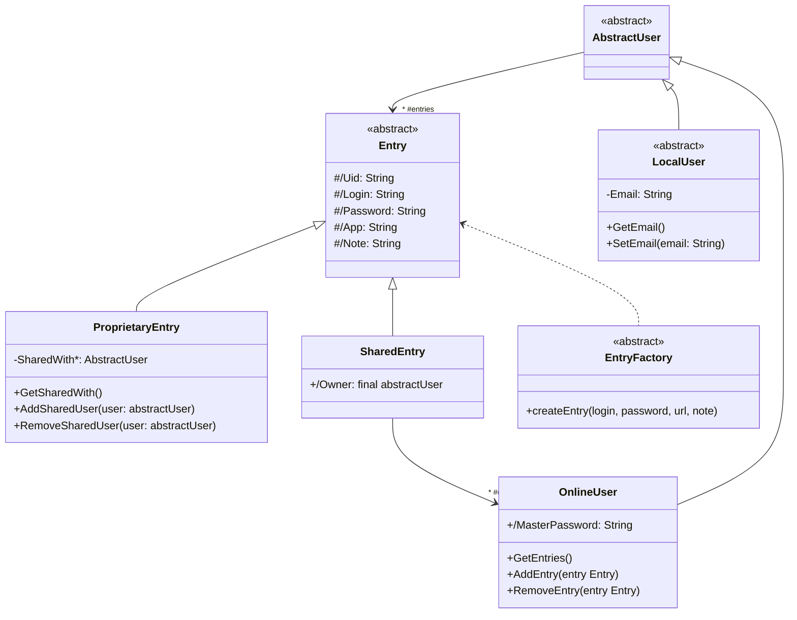
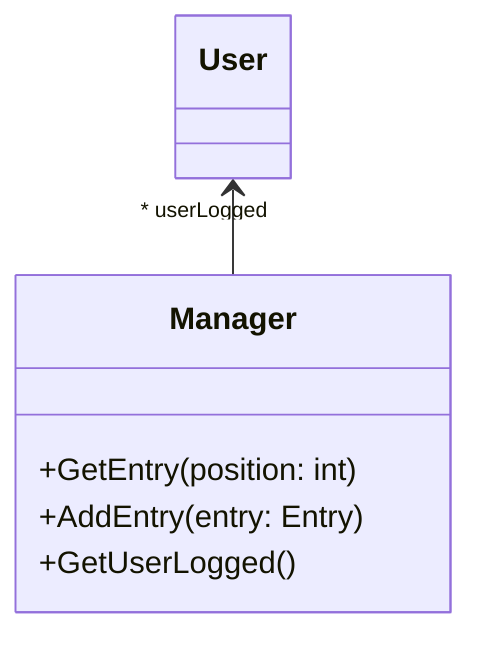
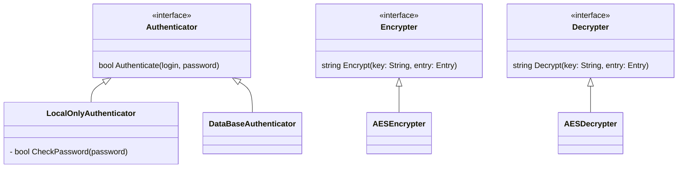

```mermaid
classDiagram
class Entry{
    <<abstract>>
    #/Uid: String
    #/Login: String
    #/Password: String
    #/App: String
    #/Note: String
}
class AbstractUser{
    <<abstract>>
}
class LocalUser{
    <<abstract>>
    -Email: String

    +GetEmail()
    +SetEmail(email: String)
}
class OnlineUser{
    +/MasterPassword: String

    +GetEntries()
    +AddEntry(entry Entry)
    +RemoveEntry(entry Entry)
}
AbstractUser --> "* #entries" Entry
class ProprietaryEntry{
    -SharedWith*: AbstractUser

    +GetSharedWith()
    +AddSharedUser(user: abstractUser)
    +RemoveSharedUser(user: abstractUser)
}
Entry <|-- ProprietaryEntry

class SharedEntry{
    +/Owner: final abstractUser
}

SharedEntry --> "* #owner" OnlineUser
Entry <|-- SharedEntry

%%classes that use ProprietaryEntry

AbstractUser <|-- LocalUser
AbstractUser <|-- OnlineUser

class EntryFactory{
    <<abstract>>
    +createEntry(login, password, url, note)
}
Entry <.. EntryFactory
```
---

```mermaid
classDiagram

class Manager{
    +GetEntry(position: int)
    +AddEntry(entry: Entry)
    +GetUserLogged()
}

User "* userLogged"<-- Manager

```
---

```mermaid
classDiagram

Authenticator <|-- LocalOnlyAuthenticator
Authenticator <|-- DataBaseAuthenticator
class Authenticator{
    <<interface>>
    bool Authenticate(login, password)
}
class LocalOnlyAuthenticator{
    - bool CheckPassword(password)
}

class Encrypter {
    <<interface>>
    string Encrypt(key: String, entry: Entry)
}
class Decrypter{
    <<interface>>
    string Decrypt(key: String, entry: Entry)
}

Encrypter <|-- AESEncrypter
Decrypter <|-- AESDecrypter
```

note: add autocompletion