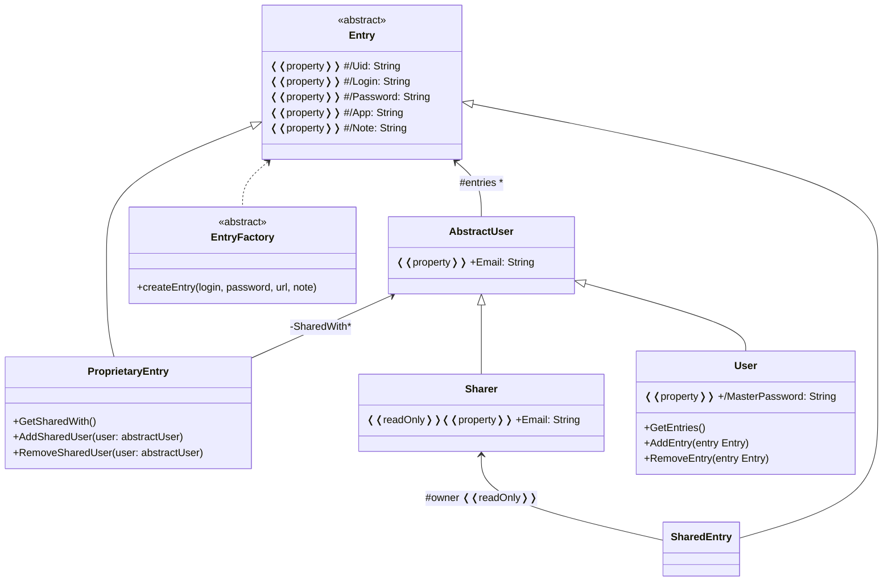
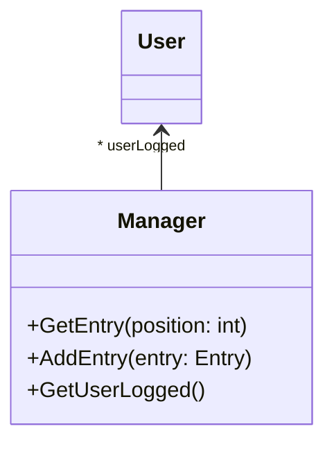
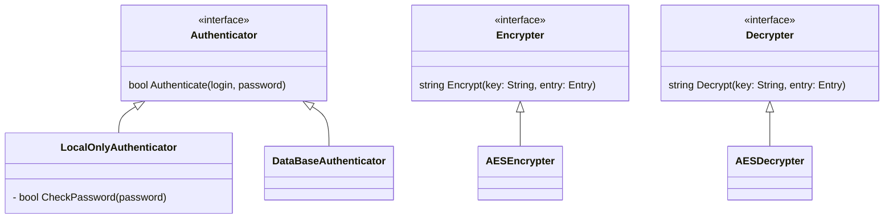

```mermaid
classDiagram

class Entry{
    <<abstract>>
    ❬❬property❭❭ #/Uid: String
    ❬❬property❭❭ #/Login: String
    ❬❬property❭❭ #/Password: String
    ❬❬property❭❭ #/App: String
    ❬❬property❭❭ #/Note: String
}
class AbstractUser{
    ❬❬property❭❭ +Email: String
}
Entry <-- AbstractUser :#entries *
class ProprietaryEntry{
    +GetSharedWith()
    +AddSharedUser(user: abstractUser)
    +RemoveSharedUser(user: abstractUser)
}
Entry <|-- ProprietaryEntry
AbstractUser <-- ProprietaryEntry :-SharedWith*
class SharedEntry{
     
}
Sharer <-- SharedEntry :#owner ❬❬readOnly❭❭
Entry <|-- SharedEntry

%%classes that use ProprietaryEntry

class User{
    ❬❬property❭❭ +/MasterPassword: String

    +GetEntries()
    +AddEntry(entry Entry)
    +RemoveEntry(entry Entry)
}
AbstractUser <|-- User

class Sharer{
    ❬❬readOnly❭❭❬❬property❭❭ +Email: String
}
AbstractUser <|-- Sharer

class EntryFactory{
    <<abstract>>
    +createEntry(login, password, url, note)
}
Entry <.. EntryFactory
```
---

```mermaid
classDiagram

class Manager{
    +GetEntry(position: int)
    +AddEntry(entry: Entry)
    +GetUserLogged()
}

User "* userLogged"<-- Manager

```
---

```mermaid
classDiagram

Authenticator <|-- LocalOnlyAuthenticator
Authenticator <|-- DataBaseAuthenticator
class Authenticator{
    <<interface>>
    bool Authenticate(login, password)
}
class LocalOnlyAuthenticator{
    - bool CheckPassword(password)
}

class Encrypter {
    <<interface>>
    string Encrypt(key: String, entry: Entry)
}
class Decrypter{
    <<interface>>
    string Decrypt(key: String, entry: Entry)
}

Encrypter <|-- AESEncrypter
Decrypter <|-- AESDecrypter
```

note: add autocompletion