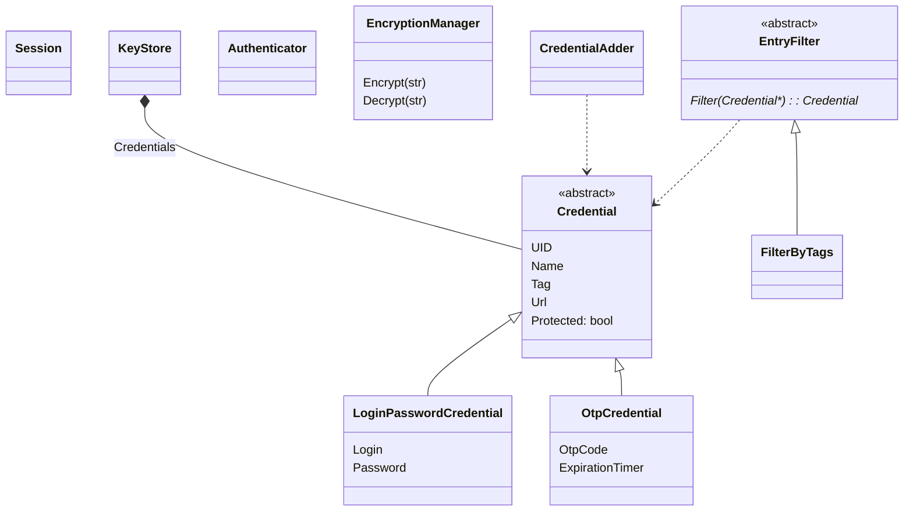

# Simple class diagram
This simple class diagram is here to give a quick idea of our business classes. This is the source code. You can modify it in a text editor, and regenerate an svg or png thanks to [mermaid.live](https://mermaid.live).

KeyStore is our applicato