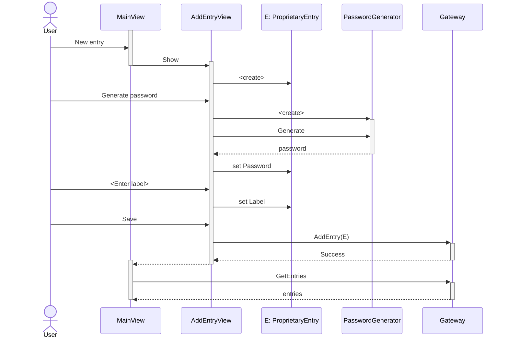

# Adding a new entry

```mermaid
sequenceDiagram

actor U as User
participant Mv as MainView
participant Av as AddEntryView
participant e as E: ProprietaryEntry
participant G as PasswordGenerator


activate Mv
U->>Mv: New entry
Mv->>+Av: Show
deactivate Mv
Av->>e: <create>
U->>Av: Generate password
Av->>+G: <create>
Av->>G: Generate
G-->>-Av: password
Av->>e: set Password
U->>Av: <Enter label>
Av->>e: set Label
U->>Av: Save
Av->>+Gateway: AddEntry(E)
Gateway-->>-Av: Success
Av-->>+Mv: 
deactivate Av
Mv->>+Gateway: GetEntries
Gateway-->>-Mv: entries
deactivate Mv
```