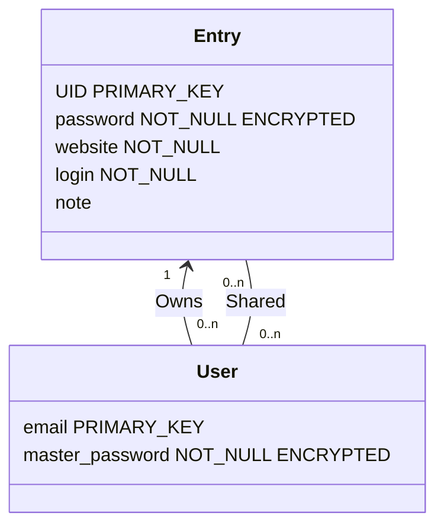

```mermaid
classDiagram

class User{
    email PRIMARY_KEY
    master_password NOT_NULL ENCRYPTED
}
class Entry{
    UID PRIMARY_KEY
    password NOT_NULL ENCRYPTED
    website NOT_NULL
    login NOT_NULL
    note
}
Entry "1"<--"0..n" User : Owns
Entry "0..n"--"0..n" User : Shared

```