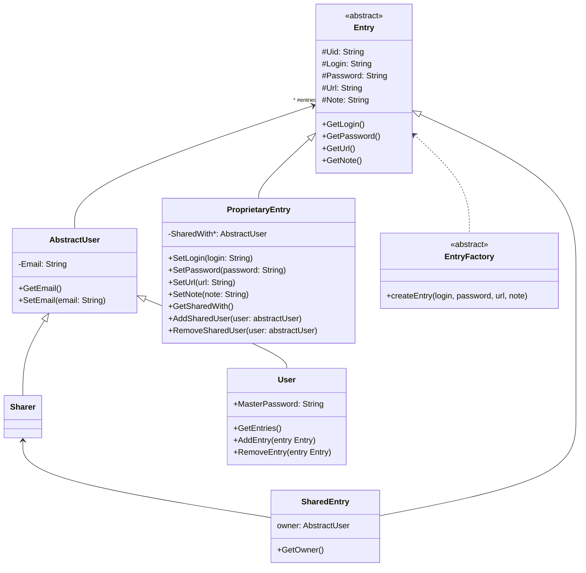
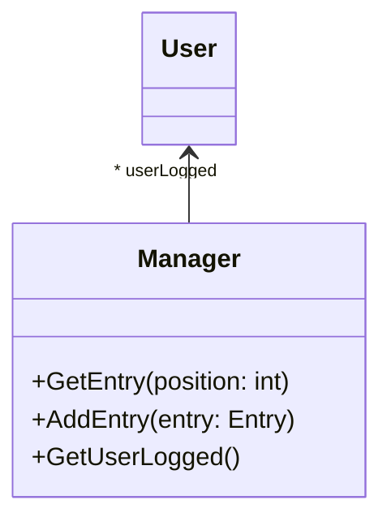
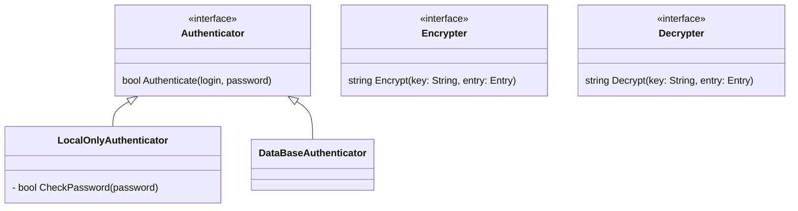

```mermaid
classDiagram

class Entry{
    <<abstract>>
    #Uid: String
    #Login: String
    #Password: String
    #Url: String
    #Note: String

    +GetLogin()
    +GetPassword()
    +GetUrl()
    +GetNote()
}
class AbstractUser{
    -Email: String

    +GetEmail()
    +SetEmail(email: String)
}
Entry "* #entries"<-- AbstractUser
class ProprietaryEntry{
    -SharedWith*: AbstractUser

    +SetLogin(login: String)
    +SetPassword(password: String)
    +SetUrl(url: String)
    +SetNote(note: String)
    +GetSharedWith()
    +AddSharedUser(user: abstractUser)
    +RemoveSharedUser(user: abstractUser)
}
Entry <|-- ProprietaryEntry

class SharedEntry{
    owner: AbstractUser
    +GetOwner()
}
Sharer <-- SharedEntry
Entry <|-- SharedEntry

%%classes that use ProprietaryEntry

class User{
    +MasterPassword: String

    +GetEntries()
    +AddEntry(entry Entry)
    +RemoveEntry(entry Entry)
}
AbstractUser <|-- User

class Sharer{
    
}
AbstractUser <|-- Sharer

class EntryFactory{
    <<abstract>>
    +createEntry(login, password, url, note)
}
Entry <.. EntryFactory
```

```mermaid
classDiagram

class Manager{
    +GetEntry(position: int)
    +AddEntry(entry: Entry)
    +GetUserLogged()
}

User "* userLogged"<-- Manager

```

```mermaid
classDiagram

Authenticator <|-- LocalOnlyAuthenticator
Authenticator <|-- DataBaseAuthenticator
class Authenticator{
    <<interface>>
    bool Authenticate(login, password)
}
class LocalOnlyAuthenticator{
    - bool CheckPassword(password)
}

class Encrypter {
    <<interface>>
    string Encrypt(key: String, entry: Entry)
}
class Decrypter{
    <<interface>>
    string Decrypt(key: String, entry: Entry)
}
```

note: add autocompletion