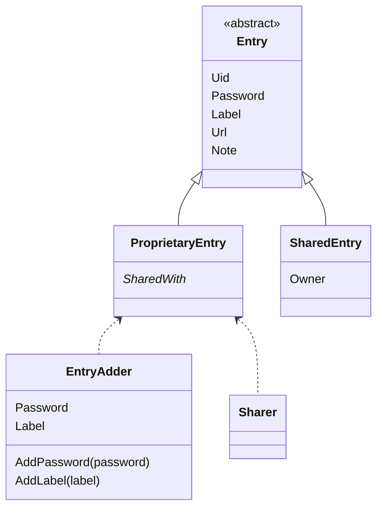
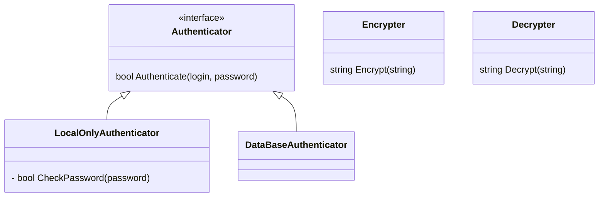

```mermaid
classDiagram

class Entry{
    <<abstract>>
    Uid
    Password
    Label
    Url
    Note
}
class ProprietaryEntry{
    SharedWith*
}
class SharedEntry{
    Owner
}
Entry <|-- ProprietaryEntry
Entry <|-- SharedEntry

%%classes that use ProprietaryEntry
ProprietaryEntry <.. EntryAdder
ProprietaryEntry <.. Sharer

class EntryAdder{
    Password
    Label
    AddPassword(password)
    AddLabel(label)
}
```

```mermaid
classDiagram

Authenticator <|-- LocalOnlyAuthenticator
Authenticator <|-- DataBaseAuthenticator
class Authenticator{
    <<interface>>
    bool Authenticate(login, password)
}
class LocalOnlyAuthenticator{
    - bool CheckPassword(password)
}

class Encrypter {
    string Encrypt(string)
}
class Decrypter{
    string Decrypt(string)
}
```

note: add autocompletion