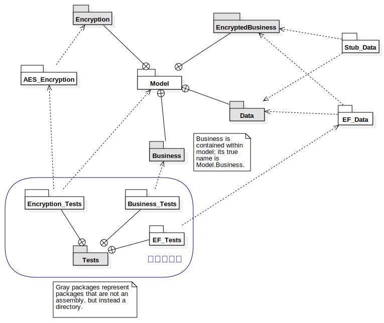

# Package diagram

Author: Elliott LE GUEHENNEC
Date: October 11th, 2022

This diagram represents the structure of our project's packages, following UML conventions with a couple add-ons for clarity.
It does not contain any launcher or temporary assembly that could have been created for testing reasons.

As indicated in one of the notes on the top right, white packages represent an assembly, whereas gray ones are directories inside the soltion or another assembly.

The blue area in the bottom outlines our test packages and is present for clarity purposes only.

The `model` package is our central package...