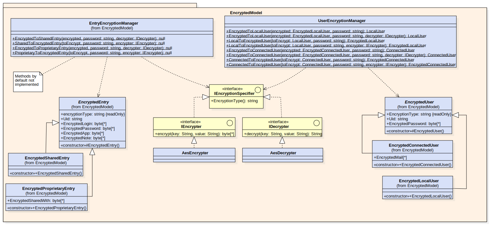

# Class diagram & explanations

## Model

### Entries

The `Entry` class represents each entry in the app. It contains a *unique identifier*, the `Password` we save, a `Label`, the `Url` of the website that the password belongs to, and a `Note` for additionnal information.

`Entry` is abstract because its inheriting classes `ProprietaryEntry` and `SharedEntry` will enable us to check if we possess said `Entry` or not, based on its type. An `Entry` cannot be shared or edited by anyone other than the owner.

*SharedEntry* is the immuable class for the entry someone share with us. It don't overload property setter to still immuable.

*ProprietaryEntry* is the class for entries we own.

### Users
The users also need a layer of abstraction, because we must differenciate between a `User` which can be edited, and a `Sharer` which only gives access to its mail.

*LocalUser* is the user without an account on the server, and only local. It contains only a password.

*MailedUser* and his children is the class for a user registered on the server, with a mail and a password. *SharerUser* is the user who share a password with us, so we can edit it, and the *ConnectedUser* is the user logged in the app.

### Manager
The manager will manage all the app model.

---

## EncryptedModel

### Encrypter and Decrypter interfaces
These interfaces, as their name suggest, are used to provide and easy way to encrypt and decrypt data using various algorithm, here the only one that's implemented is the `AES-128` algorithm with the implementing classes `AesDecrypter` and `AesEncrypter`. We also have an interface that provides the name of the algorithm currently in use, `IEncryptionSpecifier`. This information should be used to ensure that no encrypted data is decrypted using the wrong algorithm.

### Encrypted Entries
The `Encrypted Entry` classes represent the same classes as the `Entry` classes but encrypted, with their data being stored as an array of bytes, at the exception of the `UID` which is kept clear for use in the database (non-critical information). It also stores the used encryption algorithm as a `string` which is retreived during encryption or decryption with the `IEncryptionSpecifier` interface.

### Entry Encryption Manager
The `EntryEncryptionManager` class manages the encryption and decryption of entries within the model.