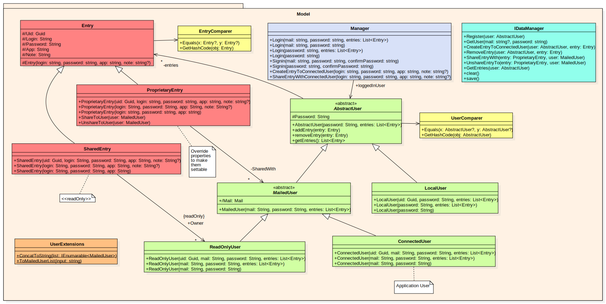

# Class diagram & explanations

The following file have for goal to explain the main part of the **Rossignol** project!

## Sumary

* [Model](##Model)
* [Encryption](##Encryption)
* [EF Model](##EntityFrameworkModel)

---

## Model

### Entries (red)

The `Entry` class represents one entry; meaning, one set of credentials the user has stored in the app. It contains a `unique identifier`, the `Password` we save, the `Url` of the website that the password belongs to, a `Login`, a `Label` which is just the combination of the previous two, and a `Note` for additional information. This class is abstract, and specialises into two separate classes with distinct behaviours:
- *ProprietaryEntry* is an entry owned by the logged in user. While every field of `Entry` is read-only, this class allows modifications on its fields.
- *SharedEntry* is an entry owned by another user that has shared it with the logged in user. In addition to the read-only fields, it knows its `Owner`.

Semantically speaking, an entry can only be modified by its owner.

### Users (green)

The users also need a layer of abstraction, because we must differenciate between a `User` which can be edited, and a `Sharer` which only gives access to its mail.

`LocalUser` is the user without an account on the server, and only local. It contains only a password.

`MailedUser` and his children are the classes for a user registered on the server, with a mail and a password. `SharerUser` is the user who share a password with us, so we can edit it, and the `ConnectedUser` is the user logged in the app.

We also have a `UserExtensions` class which contains utility extension methods for an abstract user.

### Manager (blue)

The manager is tasked with handling the application logic. It has knowledge of the currently connected user through its `LoggedInUser` property; and therefore also has access to the entries to display.

This manager handles logging in and signing in, listing, editing and sharing entries.

---

## Encryption

### Encrypter and Decrypter interfaces

These interfaces, as their name suggest, are used to provide and easy way to encrypt and decrypt data using various algorithm, here the only one that's implemented is the `AES-128` algorithm with the implementing classes `AesDecrypter` and `AesEncrypter`. We also have an interface that provides the name of the algorithm currently in use, `IEncryptionSpecifier`. This information should be used to ensure that no encrypted data is decrypted using the wrong algorithm.

These are in separate assemblies as part of a strategy pattern. If we ever want to add a new encryption algorithm to our app, we can create a new assembly, two classes that implement respectively IEncrypter and IDecrypter, and release our project to depend on those instead of AES.

### Encrypted Entries

The `Encrypted Entry` classes represent the same classes as the `Entry` classes but encrypted, with their data being stored as an array of bytes, at the exception of the `UID` which is kept clear for use in the database (non-critical information). It also stores the used encryption algorithm as a `string` which is retreived during encryption or decryption with the `IEncryptionSpecifier` interface.

### Encrypted Users

These classes represent the same data as `AbstractUser` classes but encrypted, with their data being stored as an array of bytes. As their email is now encrypted they gain a UID to distinguish them.

### Encryption Managers

The `EntryEncryptionManager` class manages the encryption and decryption of entries within the model. The `UserEncryptionManager` does the same for users. Both managers handle both encryption and decryption.

---

## EntityFrameworkModel

This package contains all classes used to handle Entity Framework, our database model.

### RossignolContextLocal
This class allows us to create our database.

### Entities
The classes in this package are a representation of our business classes, ready to be stored in our database.

### Utils
Classes in this package contain extension methods to convert any `Entity` from **Entity Framework** to a model class, and the other way around.   *In our case, the model class came from the EncryptedModel.*

### Managers
These handle the Entity Framework logic. They are manipulated by the DataManager, and regroup every authorized operation for the app.