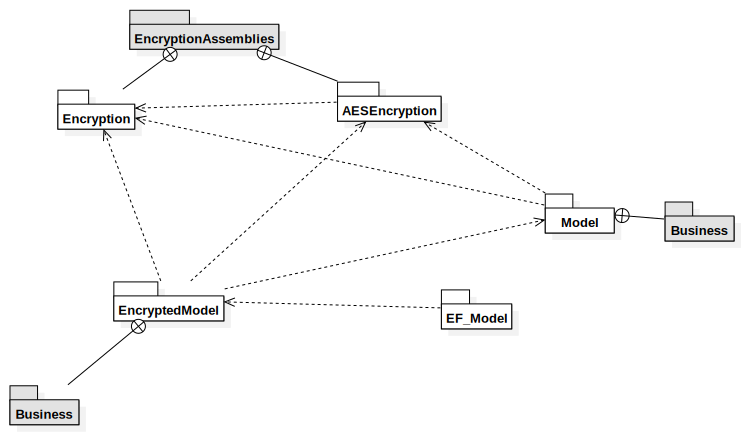
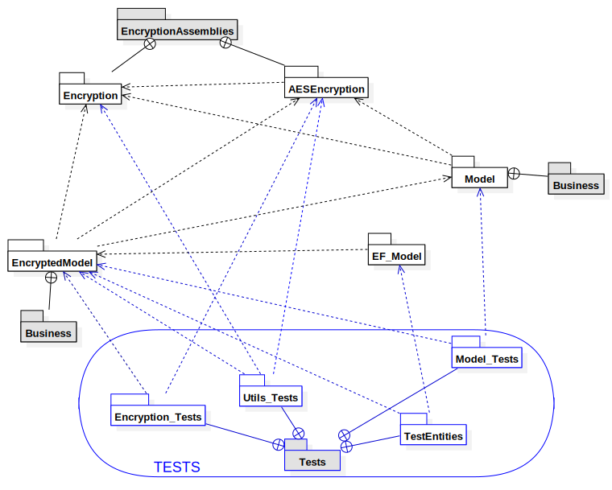

# Package diagram

This diagram represents the structure of our project's packages, following UML conventions with a couple add-ons for clarity.
It does not contain any launcher or temporary assembly that could have been created for testing reasons.

As indicated in one of the notes on the top right, white packages represent an assembly, whereas gray ones are directories inside the soltion or another assembly.

The blue area in the bottom outlines our test packages and is present for clarity purposes only.

* In `Model` itself you'll find managers and classes that control the logic of the application.
`Business`, as the name implies, contains the business classes for the application, more specifically those that will be manipulated by the views, and that the user can interact with.
* `EncryptedModel.Business`, on the other hand, contains an encrypted version of some business classes, and `EncryptedModel` itself contains all logic to encrypt and decrypt classes. 
* These are the classes that will be saved for security reasons.

* `Data` contains interfaces to abstract the persistance of data. It also contains a stub to test the data.
* `EF_Model` implements the data interfaces and handles the persistance through Entity Framework.
* The model will only manipulate persistance through the abstract interfaces of Data, and will be able to use one of the concrete implementations thanks to a dependancy injection on launch.

Same goes for the `Encryption` package. 
* It contains interfaces to encrypt and decrypt strings with an algorithm which is specified in its implementations.
`AES_Encryption` is a such implementation.
* It will be used through the abstraction of the abstract encryption interfaces, thanks to a dependancy injection into the encrypted model's `EncryptionManager`.

 

Finally, the area at the bottom of the screen contains our tests suite.
Tests are separated in different assemblies according to what they are testing.