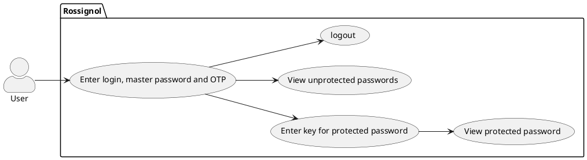

This directory contains the basic use case diagram for this project. Written in Plantuml.

```plantuml
@startuml
left to right direction
skinparam actorStyle awesome
actor User as user

package Rossignol{
  usecase "Enter login, master password and OTP" as UC1
  usecase "Enter key for protected password" as UC2
  usecase "View unprotected passwords" as UC3
  usecase "View protected password" as UC4
  usecase "logout" as UCX
}
user --> UC1
UC1 --> UC2
UC1 --> UC3
UC2 --> UC4
UC1 --> UCX
@enduml
```