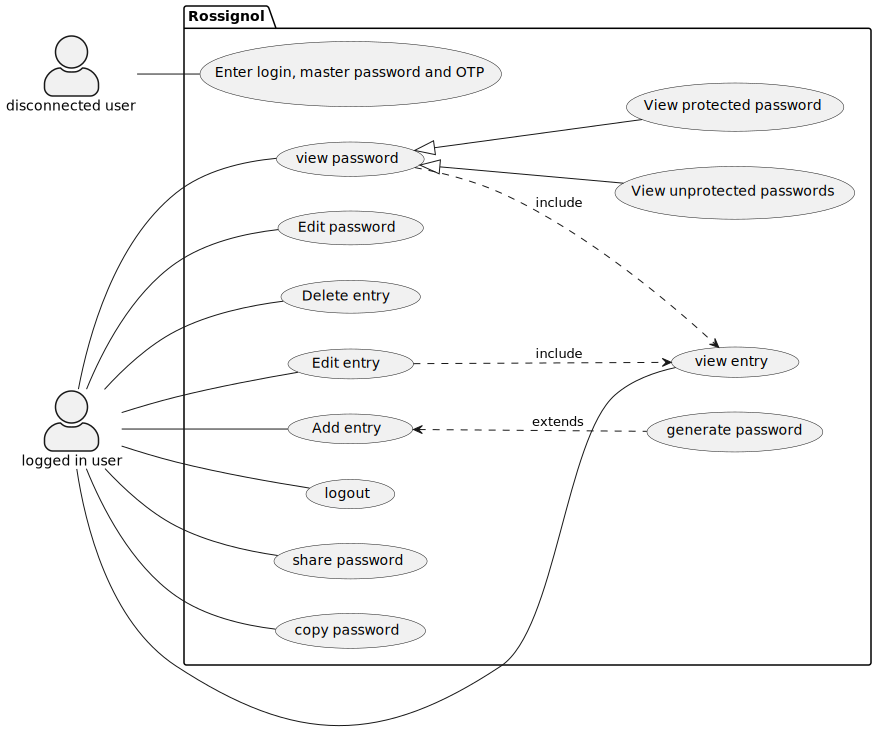

This directory contains the basic use case diagram for this project. Written in Plantuml.

Description:
We have two users present in this use case diagram of the rossignol app:
- the disconnected user, who has very limited access to the app's features and can only login to be any allowed further access.
- the connected user, who has entered their credentials and has access to a much larger number of features.

These features include the following:
- Adding, viewing and modifying entries, entries are defined as the main way to check on your passwords, they consist of a name, an url to the website and the password itself.
- copying the password can be done by clicking on the copy button on each entry, it provides an easy and quick way to get said password.
- sharing a password enables another rossignol user to view a specific entry from your account, this access is server-sided and you can revoke it at any time.
- password can be either protected or unprotected. A protected password will require the user to enter the same password as to log into the app (deseigned as "master password") in order to be displaye or copied.
- deleting an entry requires the master password in order to prevent accidental deletion.
- finally, the user can log out of the app. This option will return the app to its original state, prompting the user to log in.