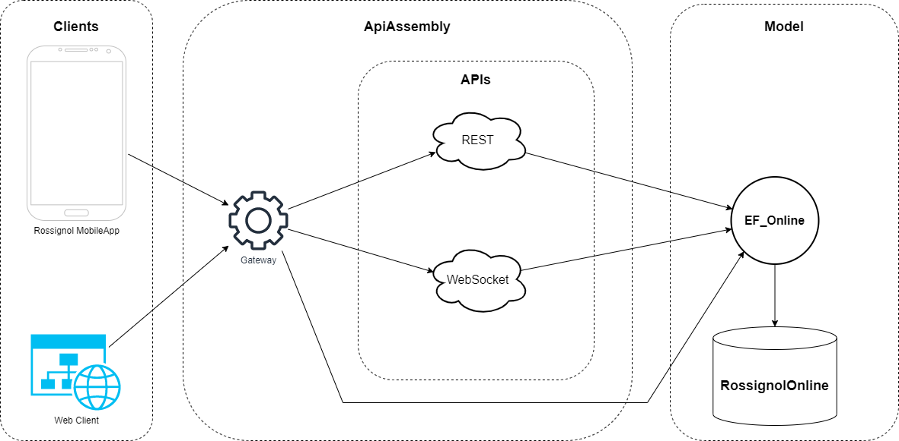

# Webservices

This file contains all the explainations of the webservices architectures used in the Rossignol project.

## API Description

To be able to interact with our model and database, we choose to use 2 diferents APIs to feet with our needs.
> The REST API will be used to interract with the datas themself.
> The WebSocket will be used to send notifications to clients.

### REST

A **REST** *(Representational State Transfer)* **API** is a type of `web architecture` and a set of constraints that are usually applied to web services. The goal of a **RESTful API** is to provide a simple and consistent interface for interacting with a service.

**RESTful APIs** use HTTP requests to POST *(create)*, PUT *(update)*, GET *(read)*, and DELETE data. A **RESTful API** is typically made up of a number of endpoints, each representing a specific resource or collection of resources.

**RESTful APIs** are typically easier to use and understand than other types of web services because they rely on the standard HTTP methods *(GET, POST, PUT, DELETE, etc.)*. Additionally, because RESTful APIs are based on standard HTTP protocols, they can be used with a wide variety of programming languages and technologies, including Java, C#, Python and many more.

**RESTful API** is preferred for many reasons, some of them are:

- They are simple, the **API** is easy to understand and can be consumed easily
- They are lightweight, **RESTful API's** are lightweight, fast and easy to implement
- They are stateless, **RESTful API's** are stateless, which means that the server does not store any information about the client session on the server side
- They are cacheable, **RESTful API's** can be cached which can lead to better performance
- They are scalable, **RESTful API's** are scalable, which means that the system can handle a large number of requests and can be easily scaled horizontally.

Overall, **RESTful API** is a popular choice for building web services because it is easy to use and understand, and it is based on standard web technologies and protocols.

### WebSocket

A **WebSocket API** is a type of **API** that enables real-time, bidirectional communication between a client and a server. Unlike **RESTful APIs**, which rely on HTTP requests and responses, WebSocket APIs use a single, long-lived connection to enable real-time communication.

**WebSocket** communication starts with an HTTP handshake, after which the connection is upgraded to a **WebSocket** connection. Once the connection is established, the client and server can send messages to each other in real-time without the need for an HTTP request/response cycle.

A **WebSocket API** allows clients to subscribe to specific events, so the server can push new data to the client without the client having to actively request it. This makes **WebSocket APIs** well-suited for use cases where low-latency, real-time communication is needed, such as real-time notifications, chat applications, and online gaming.

**WebSocket API** are preferred for many reasons, some of them are:

- They are real-time, **WebSocket API's** enables real-time, bidirectional communication between client and server
- They are efficient, **WebSocket API's** are efficient, they use a single, long-lived connection which reduces overhead and improves performance
- They are flexible, **WebSocket API's** are flexible, they can be used for a variety of use cases, including real-time notifications, chat applications, and online gaming
- They are low-latency, **WebSocket API's** are low-latency, which means that the server can push new data to the client without the client having to actively request it.
- They are event-driven, **WebSocket API's** allows clients to subscribe to specific events, so the server can push new data to the client without the client having to actively request it.

Overall, **WebSocket API** is a popular choice for building real-time applications because it enables low-latency, bidirectional communication and it is more efficient than **RESTful API's**.

---
## Gateway

...

---
## Architecture

... explainations (more than 500 words)

**Schemas:**

